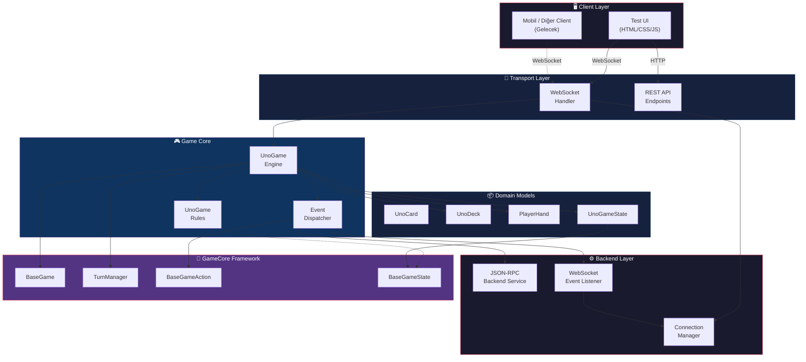
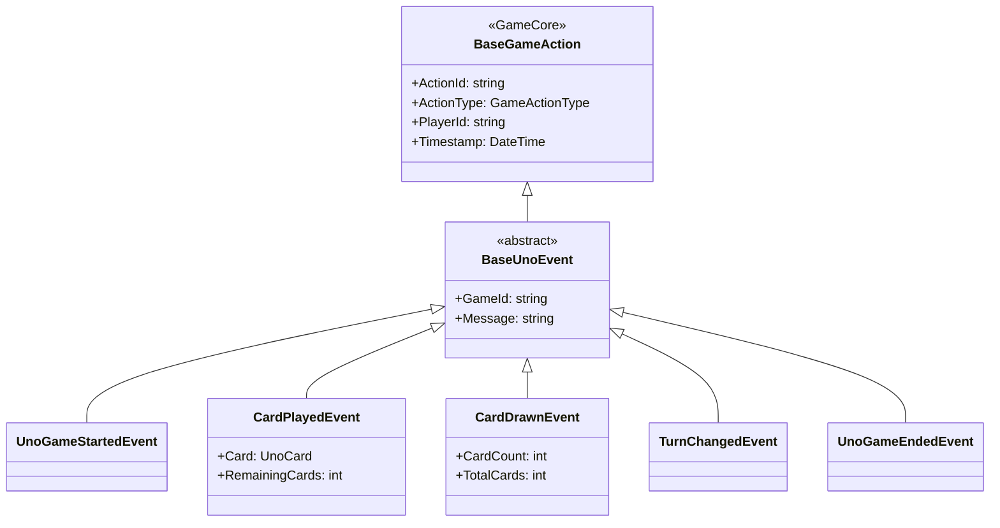

# 🎮 UnoGame — Real-Time Multiplayer UNO Card Game

<div align="center">


**Resmi UNO kurallarına uygun, gerçek zamanlı çok oyunculu UNO kart oyunu.**

WebSocket üzerinden anlık iletişim • JSON-RPC 2.0 protokolü • Event-Driven mimari • SOLID prensipleri

[Kurulum](#-kurulum) · [Mimari](#-mimari-genel-bakış) · [API Referansı](#-websocket-api-referansı) · [Oyun Kuralları](#-oyun-kuralları)

</div>

---

## 📋 İçindekiler

- [Proje Hakkında](#-proje-hakkında)
- [Özellikler](#-özellikler)
- [Teknoloji Stack](#-teknoloji-stack)
- [Kurulum](#-kurulum)
- [Mimari Genel Bakış](#-mimari-genel-bakış)
- [Proje Yapısı](#-proje-yapısı)
- [Katmanlı Mimari Detayları](#-katmanlı-mimari-detayları)
- [WebSocket API Referansı](#-websocket-api-referansı)
- [REST API Endpoints](#-rest-api-endpoints)
- [Oyun Kuralları](#-oyun-kuralları)
- [Test Arayüzü](#-test-arayüzü)
- [Geliştirme Notları](#-geliştirme-notları)

---

## 🎯 Proje Hakkında

**UnoGame**, .NET 9.0 üzerinde geliştirilmiş, WebSocket tabanlı gerçek zamanlı çok oyunculu bir UNO kart oyunu motorudur. Proje, oyun geliştirme sürecinde yazılım mühendisliği prensiplerinin (SOLID, Event-Driven Architecture, Clean Architecture) nasıl uygulanacağını gösteren kapsamlı bir örnek uygulamadır.

Sistem, **GameCore** adlı genel amaçlı bir oyun çerçevesi (framework) üzerine inşa edilmiştir. GameCore, oyun yaşam döngüsü, tur yönetimi, oyuncu modelleri ve event dispatching gibi temel mekanizmaları sağlarken, UnoGame projesi UNO'ya özgü iş mantığını (kart kuralları, deste yönetimi, özel kart efektleri) bu çerçeve üzerinde implemente eder.

### Motivasyon

- **Gerçek zamanlı iletişim**: WebSocket ile düşük gecikmeli, çift yönlü haberleşme
- **Protokol standardizasyonu**: JSON-RPC 2.0 ile tutarlı ve genişletilebilir mesajlaşma
- **Genişletilebilir mimari**: Yeni oyunlar (Pişti, Okey vb.) aynı GameCore altyapısı üzerine kolayca inşa edilebilir
- **SOLID prensipleri**: İş yerinde kullanılabilir düzeyde temiz kod ve ayrıştırılmış sorumluluklar

---

## ✨ Özellikler

### Oyun Mekaniği
- ✅ Standart 108 kartlık UNO destesi (4 renk × 25 kart + 8 Wild kart)
- ✅ Resmi UNO kurallarına tam uyum
- ✅ Özel kart efektleri: **Skip**, **Reverse**, **Draw Two**, **Wild**, **Wild Draw Four**
- ✅ UNO çağırma mekanizması (+2 ceza)
- ✅ Draw kartı stacking (üst üste +2/+4 atabilme)
- ✅ Kart çekme sonrası oynama veya pas geçme seçeneği
- ✅ Otomatik deste yeniden karıştırma (deste bittiğinde)
- ✅ Oyun sonu tespiti ve kazanan belirleme

### Teknik Özellikler
- ✅ WebSocket ile gerçek zamanlı çift yönlü iletişim
- ✅ JSON-RPC 2.0 standardına uygun mesaj formatı
- ✅ Event-Driven Architecture ile loosely-coupled bileşenler
- ✅ Thread-safe bağlantı yönetimi (`ConcurrentDictionary`)
- ✅ Async/await tabanlı non-blocking I/O
- ✅ GameCore framework üzerinde genişletilebilir tasarım
- ✅ Web tabanlı test arayüzü (HTML/CSS/JS)
- ✅ REST API endpoints (durum kontrolü, oyun state)
- ✅ Kapsamlı hata yönetimi ve özel exception sınıfları

---

## 🛠 Teknoloji Stack

| Katman | Teknoloji | Açıklama |
|--------|-----------|----------|
| **Runtime** | .NET 9.0 | Modern, cross-platform çalışma ortamı |
| **Dil** | C# 13 | Strongly-typed, OOP & FP desteği |
| **Web Server** | ASP.NET Core (Kestrel) | Yüksek performanslı HTTP/WebSocket sunucu |
| **İletişim** | WebSocket | Full-duplex, düşük gecikmeli gerçek zamanlı iletişim |
| **Protokol** | JSON-RPC 2.0 | Standart, genişletilebilir RPC mesaj formatı |
| **Serialization** | System.Text.Json | Yüksek performanslı JSON işleme |
| **Framework** | GameCore (custom) | Oyun yaşam döngüsü, tur yönetimi, event sistemi |
| **Frontend** | HTML5 / CSS3 / Vanilla JS | Hafif, bağımlılıksız test arayüzü |

---

## 🚀 Kurulum

### Ön Gereksinimler

- [.NET 9.0 SDK](https://dotnet.microsoft.com/download/dotnet/9.0)
- Git

### Adım 1: Projeyi Klonlayın

```bash
git clone https://github.com/Vibe-Social-App/UnoGame.git
cd UnoGame
```

### Adım 2: Bağımlılıkları Yükleyin

```bash
dotnet restore
```

### Adım 3: Projeyi Derleyin

```bash
dotnet build
```

### Adım 4: Sunucuyu Başlatın

```bash
dotnet run
```

Sunucu başlatıldığında aşağıdaki çıktıyı göreceksiniz:

```
═══════════════════════════════════════════
     UNO OYUNU - WebSocket Sunucusu
═══════════════════════════════════════════

✅ 3 oyuncu eklendi
✅ WebSocket Event Listener aktif!
✅ JSON-RPC Backend Service aktif!

═══════════════════════════════════════════
   Sunucu başlatiliyor...
   WebSocket: ws://localhost:5000/ws?playerId=p1
    Test UI:   http://localhost:5000
   API:       http://localhost:5000/api/status
═══════════════════════════════════════════
```

### Adım 5: Test Arayüzünü Açın

Tarayıcınızda `http://localhost:5000` adresine gidin.

---

## 🏗 Mimari Genel Bakış

Proje, **katmanlı mimari** (Layered Architecture) ve **Event-Driven Architecture** prensiplerine göre tasarlanmıştır.



### Veri Akışı

```
Client (WebSocket) → WebSocketHandler → UnoGame Engine → Event Dispatcher
                                                              ↓
                                          ┌─────────────────────────────────────┐
                                          │  WebSocketEventListener (broadcast) │
                                          │  JsonRpcBackendService (logging)    │
                                          │  ConsoleEventListener (debug)       │
                                          └─────────────────────────────────────┘
                                                              ↓
                                                    All Connected Clients
```

1. **Client** WebSocket üzerinden JSON-RPC 2.0 formatında komut gönderir
2. **WebSocketHandler** mesajı parse eder ve uygun oyun aksiyonunu çağırır
3. **UnoGame Engine** kural kontrollerini yapar, state'i günceller ve event fırlatır
4. **Event Dispatcher** event'i kayıtlı tüm listener'lara iletir
5. **WebSocketEventListener** event'i JSON-RPC formatında tüm client'lara broadcast eder

---

## 📁 Proje Yapısı

```
UnoGame/
├── Program.cs                          # Uygulama giriş noktası, sunucu yapılandırması
├── UnoGame.csproj                      # Proje dosyası (.NET 9.0, GameCore referansı)
├── UnoGame.sln                         # Solution dosyası
│
├── Core/
│   └── UnoGame.cs                      # 🎮 Ana oyun motoru (644 satır)
│                                       #    - Oyun yaşam döngüsü
│                                       #    - Kart atma / çekme / pas geçme
│                                       #    - UNO çağırma mekanizması
│                                       #    - Özel kart efektleri
│                                       #    - Tur yönetimi
│
├── Models/
│   ├── Cards/
│   │   ├── UnoCard.cs                  # 🃏 Kart modeli (renk, tip, numara)
│   │   ├── UnoDeck.cs                  # 📦 108 kartlık deste (çek, at, karıştır)
│   │   └── PlayerHand.cs              # ✋ Oyuncu eli (kart ekleme/çıkarma/sorgulama)
│   └── States/
│       └── UnoGameStates.cs            # 📊 Oyun durumu (BaseGameState'den türer)
│
├── Rules/
│   └── UnoGameRules.cs                 # 📏 Oyun kuralları (IGameRules implementasyonu)
│                                       #    - Kart geçerliliği kontrolü
│                                       #    - Oyun bitiş kontrolü
│                                       #    - Kazanan belirleme
│
├── Events/
│   ├── BaseUnoEvent.cs                 # 🔔 Tüm eventlerin temel sınıfı
│   ├── UnoGameStartedEvent.cs          # Oyun başladı eventi
│   ├── CardPlayedEvent.cs              # Kart atıldı eventi
│   ├── CardDrawnEvent.cs               # Kart çekildi eventi
│   ├── TurnChangedEvent.cs             # Tur değişti eventi
│   └── UnoGameEndedEvent.cs            # Oyun bitti eventi
│
├── Listeners/
│   └── ConsoleEventListener.cs         # 🖥️ Konsol event dinleyicisi (debug)
│
├── Backend/
│   ├── Protocol/
│   │   └── JsonRpcRequest.cs           # 📨 JSON-RPC 2.0 Request/Response modelleri
│   ├── Models/
│   │   ├── EventParams.cs              # 📋 Event parametreleri (DTO'lar)
│   │   └── GameStateModels.cs          # 📋 Oyun durumu DTO'ları (CardDto, PlayerStateDto...)
│   ├── Services/
│   │   └── JsonRpcBackendService.cs    # ⚙️ Backend JSON-RPC servis (event logging)
│   └── WebSocket/
│       ├── WebSocketHandler.cs         # 🔧 Client komut işleyici (389 satır)
│       ├── WebSocketEventListener.cs   # 📡 Event → WebSocket broadcast
│       └── WebSocketConnectionManager.cs # 🔌 Bağlantı yönetimi (thread-safe)
│
└── wwwroot/
    └── index.html                      # 🌐 Web tabanlı test arayüzü (715 satır)
```

---

## 🧩 Katmanlı Mimari Detayları

### 1. Domain Layer — `Models/`

Oyunun temel veri modellerini içerir. Hiçbir harici bağımlılığı yoktur.

#### `UnoCard` — Kart Modeli
```csharp
public class UnoCard
{
    public enum CardColor { Red, Blue, Green, Yellow, Wild }
    public enum CardType  { Number, Skip, Reverse, DrawTwo, Wild, WildDrawFour }

    public CardColor Color { get; set; }
    public CardType Type { get; set; }
    public int? Number { get; set; }           // 0-9 (sadece Number tipi)
    public CardColor? ChosenColor { get; set; } // Wild kartlarda seçilen renk
}
```

#### `UnoDeck` — Deste Yönetimi
- Standart 108 kartlık UNO destesi oluşturma
- Fisher-Yates shuffle algoritması ile karıştırma
- Çekme/atma işlemleri
- Deste bittiğinde otomatik yeniden karıştırma (discard pile → draw pile)
- Başlangıç kartı çekme (Wild/özel kart çıkarsa tekrar çeker)

#### `PlayerHand` — Oyuncu Eli
- Elde kart ekleme/çıkarma
- Ortadaki karta göre atılabilir kartları filtreleme
- **Güvenlik**: Gerçek kart bilgisi sadece backend'de saklanır; diğer oyunculara sadece kart **sayısı** gönderilir

#### `UnoGameState` — Oyun Durumu
`GameCore.BaseGameState`'den türer ve UNO'ya özel durumları ekler:

| Özellik | Tip | Açıklama |
|---------|-----|----------|
| `LastPlayedCard` | `UnoCard?` | Ortadaki son kart |
| `IsClockwise` | `bool` | Oyun yönü |
| `DrawPenalty` | `int` | Bekleyen çekme cezası |
| `PlayerCardCounts` | `Dictionary<string, int>` | Oyuncu kart sayıları |

---

### 2. Rules Layer — `Rules/`

#### `UnoGameRules`
`GameCore.IGameRules` interface'ini implemente eder. Kart oynama kuralları:

| # | Kural | Açıklama |
|---|-------|----------|
| 1 | Wild kartlar | Her zaman atılabilir |
| 2 | Önceki Wild | Seçilen renge uygun kart atılabilir |
| 3 | Renk eşleşme | Aynı renk atılabilir |
| 4 | Sayı eşleşme | Aynı numara atılabilir |
| 5 | Tip eşleşme | Aynı özel kart tipi atılabilir (Skip↔Skip vb.) |

---

### 3. Core Layer — `Core/UnoGame.cs`

Oyunun ana motoru. `GameCore.BaseGame`'den türer ve tüm iş mantığını yönetir.

#### Temel Aksiyonlar

| Metod | Açıklama |
|-------|----------|
| `PlayCard(playerId, card, chosenColor?)` | Kart atma — kural kontrolü, state güncelleme, efekt uygulama |
| `DrawCard(playerId)` | Kart çekme — penalty veya normal (turda 1 kez) |
| `PassTurn(playerId)` | Pas geçme — sadece kart çektikten sonra |
| `CallUno(playerId)` | UNO çağırma — 1 kart kaldığında |

#### Kart Efektleri

```
Skip        → Sonraki oyuncu atlanır
Reverse     → Oyun yönü değişir
DrawTwo     → +2 ceza, sıra cezalı oyuncuya geçer
WildDrawFour → Renk seçimi + +4 ceza
Wild        → Renk seçimi
```

---

### 4. Event System — `Events/`

Event-Driven Architecture ile oyun aksiyonları loosely-coupled bir şekilde dinlenir.



Tüm eventler `GameCore.BaseGameAction`'dan türer ve `GameEventDispatcher` aracılığıyla kayıtlı listener'lara iletilir:
- **`WebSocketEventListener`** → Tüm client'lara broadcast
- **`JsonRpcBackendService`** → Konsol loglaması
- **`ConsoleEventListener`** → Debug çıktıları

---

### 5. Backend Layer — `Backend/`

#### WebSocket Katmanı

| Sınıf | Sorumluluk |
|-------|------------|
| `WebSocketHandler` | Client → Server mesajlarını parse eder, oyun aksiyonlarını çağırır |
| `WebSocketEventListener` | Server → Client event broadcast (game.card_played, game.turn_changed vb.) |
| `WebSocketConnectionManager` | Bağlantı listesi, broadcast, unicast, thread-safety |

#### Protokol

Tüm mesajlar **JSON-RPC 2.0** formatındadır:

```json
// Client → Server (Request)
{
    "jsonrpc": "2.0",
    "method": "game.play_card",
    "params": {
        "card": { "color": "RED", "type": "NUMBER", "number": 7 }
    },
    "id": "1"
}

// Server → Client (Response)
{
    "jsonrpc": "2.0",
    "result": {
        "success": true,
        "message": "Kart atıldı: Red 7"
    },
    "id": "1"
}

// Server → All Clients (Event/Notification)
{
    "jsonrpc": "2.0",
    "method": "game.card_played",
    "params": {
        "player_id": "p1",
        "card": { "color": "RED", "type": "NUMBER", "number": 7 },
        "remaining_cards": 5,
        "game_state": { ... }
    },
    "id": "..."
}
```

---

## 📡 WebSocket API Referansı

### Bağlantı

```
ws://localhost:5000/ws?playerId={playerId}
```

Bağlantı kurulduğunda sunucu otomatik olarak `server.welcome` mesajı gönderir.

### Client → Server Komutları

| Method | Params | Açıklama |
|--------|--------|----------|
| `game.play_card` | `{ card: CardDto, chosen_color?: string }` | Kart at |
| `game.draw_card` | — | Kart çek |
| `game.pass_turn` | — | Pas geç (kart çektikten sonra) |
| `game.call_uno` | — | UNO! çağır |
| `game.get_hand` | — | Eldeki kartları al |
| `game.get_state` | — | Oyun durumunu al |

### `CardDto` Formatı

```json
{
    "color": "RED | BLUE | GREEN | YELLOW | WILD",
    "type": "NUMBER | SKIP | REVERSE | DRAW_TWO | WILD | WILD_DRAW_FOUR",
    "number": 0-9 | null
}
```

### Server → Client Event'leri

| Method | Açıklama | Tetiklenme Zamanı |
|--------|----------|-------------------|
| `server.welcome` | Hoş geldin mesajı | Bağlantı kurulduğunda |
| `game.started` | Oyun başladı | Oyun başlatıldığında |
| `game.card_played` | Kart atıldı | Her kart atıldığında |
| `game.card_drawn` | Kart çekildi | Her kart çekildiğinde |
| `game.turn_changed` | Tur değişti | Sıra değiştiğinde |
| `game.ended` | Oyun bitti | Oyun sona erdiğinde |

### Hata Kodları

| Kod | Açıklama |
|-----|----------|
| `-32700` | Geçersiz JSON |
| `-32601` | Bilinmeyen metod |
| `-32603` | Sunucu hatası |
| `-32000` | Oyun kuralı ihlali |

---

## 🌐 REST API Endpoints

| Endpoint | Method | Açıklama |
|----------|--------|----------|
| `/api/status` | `GET` | Sunucu durumu, bağlı oyuncular |
| `/api/state` | `GET` | Anlık oyun durumu (JSON) |

---

## 📋 Backend JSON Parametreleri (Tam Referans)

Bu bölüm, backend'in gönderdiği ve aldığı **tüm JSON verilerini** detaylı şekilde listeler. Tüm mesajlar **JSON-RPC 2.0** formatındadır.

---

### 📨 Client → Server Komutları (Request)

#### 1. `game.play_card` — Kart Atma

```json
{
    "jsonrpc": "2.0",
    "method": "game.play_card",
    "params": {
        "card": {
            "color": "RED",
            "type": "NUMBER",
            "number": 7
        }
    },
    "id": "req-1"
}
```

**Wild / WildDrawFour kart atarken:**

```json
{
    "jsonrpc": "2.0",
    "method": "game.play_card",
    "params": {
        "card": {
            "color": "WILD",
            "type": "WILD",
            "number": null
        },
        "chosen_color": "BLUE"
    },
    "id": "req-2"
}
```

| Parametre | Tip | Zorunlu | Açıklama |
|-----------|-----|---------|----------|
| `params.card.color` | `string` | ✅ | `RED`, `BLUE`, `GREEN`, `YELLOW`, `WILD` |
| `params.card.type` | `string` | ✅ | `NUMBER`, `SKIP`, `REVERSE`, `DRAW_TWO`, `WILD`, `WILD_DRAW_FOUR` |
| `params.card.number` | `int?` | ❌ | `0-9` (sadece `NUMBER` tipi için, diğerleri `null`) |
| `params.chosen_color` | `string?` | ❌ | Wild kartlar için seçilen renk: `RED`, `BLUE`, `GREEN`, `YELLOW` |

**Başarılı Yanıt:**

```json
{
    "jsonrpc": "2.0",
    "result": {
        "success": true,
        "message": "Kart atıldı: Red 7"
    },
    "id": "req-1"
}
```

---

#### 2. `game.draw_card` — Kart Çekme

```json
{
    "jsonrpc": "2.0",
    "method": "game.draw_card",
    "params": {},
    "id": "req-3"
}
```

**Başarılı Yanıt:**

```json
{
    "jsonrpc": "2.0",
    "result": {
        "success": true,
        "message": "Kart cekildi",
        "total_cards": 8,
        "can_play_drawn": true,
        "has_drawn": true
    },
    "id": "req-3"
}
```

| Yanıt Alanı | Tip | Açıklama |
|-------------|-----|----------|
| `total_cards` | `int` | Çektikten sonra elde kalan toplam kart sayısı |
| `can_play_drawn` | `bool` | Çekilen kart atılabilir mi? |
| `has_drawn` | `bool` | Bu turda kart çekildi mi? |

---

#### 3. `game.pass_turn` — Pas Geçme

```json
{
    "jsonrpc": "2.0",
    "method": "game.pass_turn",
    "params": {},
    "id": "req-4"
}
```

**Başarılı Yanıt:**

```json
{
    "jsonrpc": "2.0",
    "result": {
        "success": true,
        "message": "Pas gecildi, sira sonraki oyuncuda"
    },
    "id": "req-4"
}
```

> ⚠️ Pas geçme sadece aynı turda kart çektikten sonra yapılabilir.

---

#### 4. `game.call_uno` — UNO Çağırma

```json
{
    "jsonrpc": "2.0",
    "method": "game.call_uno",
    "params": {},
    "id": "req-5"
}
```

**Başarılı Yanıt:**

```json
{
    "jsonrpc": "2.0",
    "result": {
        "success": true,
        "message": "UNO!"
    },
    "id": "req-5"
}
```

---

#### 5. `game.get_hand` — Eldeki Kartları Alma

```json
{
    "jsonrpc": "2.0",
    "method": "game.get_hand",
    "params": {},
    "id": "req-6"
}
```

**Başarılı Yanıt:**

```json
{
    "jsonrpc": "2.0",
    "result": {
        "player_id": "p1",
        "cards": [
            {
                "color": "RED",
                "type": "NUMBER",
                "number": 3,
                "playable": true
            },
            {
                "color": "BLUE",
                "type": "SKIP",
                "number": null,
                "playable": false
            },
            {
                "color": "WILD",
                "type": "WILD",
                "number": null,
                "playable": true
            }
        ],
        "card_count": 3,
        "current_turn": true,
        "has_drawn": false,
        "can_play_drawn": false,
        "draw_penalty": 0,
        "game_finished": false
    },
    "id": "req-6"
}
```

| Yanıt Alanı | Tip | Açıklama |
|-------------|-----|----------|
| `player_id` | `string` | İsteyen oyuncunun ID'si |
| `cards` | `array` | Eldeki kartların listesi |
| `cards[].color` | `string` | Kart rengi |
| `cards[].type` | `string` | Kart tipi |
| `cards[].number` | `int?` | Kart numarası (sadece NUMBER tipi) |
| `cards[].playable` | `bool` | Bu kart şu an atılabilir mi? |
| `card_count` | `int` | Toplam kart sayısı |
| `current_turn` | `bool` | Sıra bu oyuncuda mı? |
| `has_drawn` | `bool` | Bu turda zaten kart çekildi mi? |
| `can_play_drawn` | `bool` | Çekilen kart oynanabilir mi? |
| `draw_penalty` | `int` | Bekleyen çekme cezası |
| `game_finished` | `bool` | Oyun bitti mi? |

---

#### 6. `game.get_state` — Oyun Durumu Alma

```json
{
    "jsonrpc": "2.0",
    "method": "game.get_state",
    "params": {},
    "id": "req-7"
}
```

**Başarılı Yanıt:**

```json
{
    "jsonrpc": "2.0",
    "result": {
        "state": {
            "game_id": "game-123",
            "game_status": "IN_PROGRESS",
            "current_round": 1,
            "current_turn_number": 5,
            "current_player_id": "p2",
            "is_clockwise": true,
            "draw_penalty": 0,
            "last_played_card": {
                "color": "RED",
                "type": "NUMBER",
                "number": 7
            },
            "players": [
                {
                    "player_id": "p1",
                    "player_name": "Ahmet",
                    "card_count": 6,
                    "score": 0,
                    "status": "ACTIVE",
                    "joined_at": "2026-03-04T17:50:00Z"
                }
            ],
            "created_at": "2026-03-04T17:50:00Z",
            "updated_at": "2026-03-04T17:55:30Z"
        },
        "current_player": "p2",
        "connected_players": ["p1", "p2", "p3"]
    },
    "id": "req-7"
}
```

---

### 📡 Server → Client Broadcast Event'leri

Bu mesajlar oyunda bir aksiyon gerçekleştiğinde **tüm bağlı client'lara** otomatik gönderilir.

#### 1. `server.welcome` — Hoş Geldin

Bağlantı kurulduğunda sadece bağlanan oyuncuya gönderilir.

```json
{
    "jsonrpc": "2.0",
    "method": "server.welcome",
    "params": {
        "message": "Hoş geldin p1! UNO oyun sunucusuna bağlandın.",
        "player_id": "p1",
        "connected_players": ["p1", "p2"],
        "last_played_card": {
            "color": "RED",
            "type": "NUMBER",
            "number": 5
        },
        "current_player": "p1",
        "draw_penalty": 0,
        "game_finished": false
    }
}
```

| Alan | Tip | Açıklama |
|------|-----|----------|
| `message` | `string` | Hoş geldin mesajı |
| `player_id` | `string` | Bağlanan oyuncunun ID'si |
| `connected_players` | `string[]` | Şu an bağlı olan oyuncu ID'leri |
| `last_played_card` | `CardDto?` | Ortadaki son kart (oyun başlamadıysa `null`) |
| `current_player` | `string` | Sırası gelen oyuncunun ID'si |
| `draw_penalty` | `int` | Bekleyen çekme cezası |
| `game_finished` | `bool` | Oyun bitti mi? |

---

#### 2. `game.started` — Oyun Başladı

```json
{
    "jsonrpc": "2.0",
    "method": "game.started",
    "params": {
        "game_id": "game-123",
        "game_type": "UNO",
        "players": [
            {
                "player_id": "p1",
                "player_name": "Ahmet",
                "card_count": 7,
                "score": 0,
                "status": "ACTIVE",
                "joined_at": "2026-03-04T17:50:00Z"
            },
            {
                "player_id": "p2",
                "player_name": "Mehmet",
                "card_count": 7,
                "score": 0,
                "status": "ACTIVE",
                "joined_at": "2026-03-04T17:50:00Z"
            },
            {
                "player_id": "p3",
                "player_name": "Ayşe",
                "card_count": 7,
                "score": 0,
                "status": "ACTIVE",
                "joined_at": "2026-03-04T17:50:00Z"
            }
        ],
        "initial_card": {
            "color": "GREEN",
            "type": "NUMBER",
            "number": 4
        },
        "first_player_id": "p1",
        "timestamp": "2026-03-04T17:50:01Z"
    },
    "id": "..."
}
```

| Alan | Tip | Açıklama |
|------|-----|----------|
| `game_id` | `string` | Oyun ID'si |
| `game_type` | `string` | Oyun tipi (her zaman `"UNO"`) |
| `players` | `PlayerStateDto[]` | Tüm oyuncuların durumu |
| `initial_card` | `CardDto` | İlk açılan kart |
| `first_player_id` | `string` | İlk oynayacak oyuncu |
| `timestamp` | `datetime` | Event zamanı (ISO 8601) |

---

#### 3. `game.card_played` — Kart Atıldı

```json
{
    "jsonrpc": "2.0",
    "method": "game.card_played",
    "params": {
        "game_id": "game-123",
        "player_id": "p1",
        "card": {
            "color": "RED",
            "type": "NUMBER",
            "number": 7
        },
        "remaining_cards": 5,
        "is_uno": false,
        "game_state": {
            "game_id": "game-123",
            "game_status": "IN_PROGRESS",
            "current_round": 1,
            "current_turn_number": 3,
            "current_player_id": "p2",
            "is_clockwise": true,
            "draw_penalty": 0,
            "last_played_card": {
                "color": "RED",
                "type": "NUMBER",
                "number": 7
            },
            "players": [
                {
                    "player_id": "p1",
                    "player_name": "Ahmet",
                    "card_count": 5,
                    "score": 0,
                    "status": "ACTIVE",
                    "joined_at": "2026-03-04T17:50:00Z"
                }
            ],
            "created_at": "2026-03-04T17:50:00Z",
            "updated_at": "2026-03-04T17:52:15Z"
        },
        "timestamp": "2026-03-04T17:52:15Z"
    },
    "id": "..."
}
```

| Alan | Tip | Açıklama |
|------|-----|----------|
| `game_id` | `string` | Oyun ID'si |
| `player_id` | `string` | Kartı atan oyuncu |
| `card` | `CardDto` | Atılan kart bilgisi |
| `remaining_cards` | `int` | Atan oyuncunun kalan kart sayısı |
| `is_uno` | `bool` | Oyuncunun 1 kartı mı kaldı? |
| `game_state` | `UnoGameStateDto` | Güncel oyun durumu |
| `timestamp` | `datetime` | Event zamanı |

---

#### 4. `game.card_drawn` — Kart Çekildi

```json
{
    "jsonrpc": "2.0",
    "method": "game.card_drawn",
    "params": {
        "game_id": "game-123",
        "player_id": "p2",
        "cards_drawn": 1,
        "total_cards": 8,
        "reason": "VOLUNTARY",
        "timestamp": "2026-03-04T17:53:00Z"
    },
    "id": "..."
}
```

| Alan | Tip | Açıklama |
|------|-----|----------|
| `game_id` | `string` | Oyun ID'si |
| `player_id` | `string` | Kart çeken oyuncu |
| `cards_drawn` | `int` | Çekilen kart adedi |
| `total_cards` | `int` | Çektikten sonra elde toplam kart sayısı |
| `reason` | `string` | Çekme sebebi: `"VOLUNTARY"` |
| `timestamp` | `datetime` | Event zamanı |

---

#### 5. `game.turn_changed` — Tur Değişti

```json
{
    "jsonrpc": "2.0",
    "method": "game.turn_changed",
    "params": {
        "game_id": "game-123",
        "previous_player_id": "p1",
        "current_player_id": "p2",
        "turn_number": 4,
        "is_clockwise": true,
        "timestamp": "2026-03-04T17:52:16Z"
    },
    "id": "..."
}
```

| Alan | Tip | Açıklama |
|------|-----|----------|
| `game_id` | `string` | Oyun ID'si |
| `previous_player_id` | `string` | Önceki oyuncu |
| `current_player_id` | `string` | Yeni sırası gelen oyuncu |
| `turn_number` | `int` | Tur numarası |
| `is_clockwise` | `bool` | Oyun yönü (saat yönü mü?) |
| `timestamp` | `datetime` | Event zamanı |

---

#### 6. `game.ended` — Oyun Bitti

```json
{
    "jsonrpc": "2.0",
    "method": "game.ended",
    "params": {
        "game_id": "game-123",
        "winner_id": "p1",
        "winner_name": "Ahmet",
        "final_scores": {
            "p1": 0,
            "p2": 0,
            "p3": 0
        },
        "total_turns": 42,
        "duration_seconds": 320.5,
        "timestamp": "2026-03-04T18:00:00Z"
    },
    "id": "..."
}
```

| Alan | Tip | Açıklama |
|------|-----|----------|
| `game_id` | `string` | Oyun ID'si |
| `winner_id` | `string?` | Kazanan oyuncu ID'si |
| `winner_name` | `string?` | Kazanan oyuncu adı |
| `final_scores` | `object` | `{ "playerId": score }` formatında son skorlar |
| `total_turns` | `int` | Toplam oynanan tur sayısı |
| `duration_seconds` | `double` | Oyun süresi (saniye) |
| `timestamp` | `datetime` | Event zamanı |

---

### 🔴 Hata Yanıtı Formatı

Herhangi bir hata durumunda:

```json
{
    "jsonrpc": "2.0",
    "error": {
        "code": -32000,
        "message": "Bu kart atilamaz!"
    },
    "id": "req-1"
}
```

| Hata Kodu | Açıklama |
|-----------|----------|
| `-32700` | Geçersiz JSON formatı |
| `-32601` | Bilinmeyen metod |
| `-32603` | Sunucu içi hata |
| `-32000` | Oyun kuralı ihlali (ör: geçersiz kart, sıra başkasında) |

---

### 📦 DTO (Data Transfer Object) Şemaları

#### `CardDto`

```json
{
    "color": "RED | BLUE | GREEN | YELLOW | WILD",
    "type": "NUMBER | SKIP | REVERSE | DRAW_TWO | WILD | WILD_DRAW_FOUR",
    "number": 0
}
```

#### `PlayerStateDto`

```json
{
    "player_id": "p1",
    "player_name": "Ahmet",
    "card_count": 7,
    "score": 0,
    "status": "ACTIVE | WAITING | ELIMINATED",
    "joined_at": "2026-03-04T17:50:00Z"
}
```

#### `UnoGameStateDto`

```json
{
    "game_id": "game-123",
    "game_status": "WAITING | IN_PROGRESS | PAUSED | COMPLETED | CANCELLED",
    "current_round": 1,
    "current_turn_number": 5,
    "current_player_id": "p2",
    "is_clockwise": true,
    "draw_penalty": 0,
    "last_played_card": { "color": "RED", "type": "NUMBER", "number": 7 },
    "players": [ ],
    "created_at": "2026-03-04T17:50:00Z",
    "updated_at": "2026-03-04T17:55:30Z"
}
```

#### `PlayerDisconnectedParams`

```json
{
    "game_id": "game-123",
    "player_id": "p1",
    "reason": "connection_lost",
    "timestamp": "2026-03-04T17:55:00Z"
}
```

---

### 🌐 REST API Yanıt Formatları

#### `GET /api/status`

```json
{
    "status": "running",
    "game_id": "game-123",
    "connected_players": ["p1", "p2", "p3"],
    "connection_count": 3
}
```

#### `GET /api/state`

Oyunun anlık tam durumunu JSON olarak döndürür (format: `UnoGameStateDto`).

---

## 🃏 Oyun Kuralları

### Standart UNO Destesi (108 kart)

| Kart Tipi | Adet | Açıklama |
|-----------|------|----------|
| Sayı kartları (0) | 4 (her renkten 1) | Kırmızı, Mavi, Yeşil, Sarı |
| Sayı kartları (1–9) | 72 (her renkten 2'şer) | Kırmızı, Mavi, Yeşil, Sarı |
| Skip | 8 (her renkten 2) | Sonraki oyuncuyu atlar |
| Reverse | 8 (her renkten 2) | Yönü değiştirir |
| Draw Two (+2) | 8 (her renkten 2) | +2 kart çektirir |
| Wild | 4 | Renk seçme |
| Wild Draw Four (+4) | 4 | Renk seçme + 4 kart çektirir |

### Oyun Akışı

1. Her oyuncuya **7 kart** dağıtılır
2. Desteden bir **başlangıç kartı** açılır (mutlaka sayı kartı)
3. Sırayla oyuncular kart atar veya çeker
4. Kart çekildikten sonra: atılabiliyorsa atabilir veya pas geçebilir
5. Elindeki tüm kartları ilk bitiren oyuncu **kazanır**

### UNO! Mekanizması

- Elinde **1 kart** kalınca **UNO!** demelisin
- Sıra geçmeden önce UNO demezsen → **+2 ceza kartı**

### Draw Kartı Stacking

- `+2` üstüne `+2` veya `+4` atılabilir
- `+4` üstüne `+4` atılabilir
- Ceza birikir, çekme sırası gelen oyuncu toplam cezayı çeker

---

## 🖥 Test Arayüzü

Proje, WebSocket bağlantılarını test etmek için dahili bir web arayüzü içerir.

**Erişim**: `http://localhost:5000`

### Özellikler

- 🎮 Oyuncu seçimi (Ahmet, Mehmet, Ayşe)
- 🔌 WebSocket bağlantı yönetimi
- 🃏 Eldeki kartları görsel olarak görüntüleme (renk kodlu)
- ✅ Atılabilir kartları yeşil çerçeveyle vurgulama
- 🎨 Wild kartlar için renk seçici
- 📤 Kart atma, çekme, pas geçme, UNO çağırma
- 📝 JSON-RPC mesaj logları (gönderilen/alınan/event)
- 🔧 Custom JSON-RPC komutu gönderme

---

## 🔧 Geliştirme Notları

### SOLID Prensipleri

| Prensip | Uygulama |
|---------|----------|
| **Single Responsibility** | Her sınıfın tek bir sorumluluğu var (UnoCard → veri, UnoDeck → deste yönetimi, UnoGameRules → kurallar) |
| **Open/Closed** | `BaseGameState` genişletildi ama değiştirilmedi (`UnoGameState`) |
| **Liskov Substitution** | `UnoGame : BaseGame` — her yerde `BaseGame` yerine kullanılabilir |
| **Interface Segregation** | `IGameRules`, `IGameEventListener`, `IAsyncGameEventListener` — küçük, odaklı interface'ler |
| **Dependency Inversion** | Oyun motoru concrete class'lara değil, `IGameRules` interface'ine bağımlı |

### Güvenlik Kararları

- **Kart bilgisi güvenliği**: Gerçek kart verisi (`PlayerHand`) sadece backend'de tutulur. Diğer oyunculara sadece kart **sayısı** gönderilir. Oyuncunun kendi kartları sadece `game.get_hand` yanıtında ilgili oyuncuya iletilir.
- **Thread-safe bağlantı**: `ConcurrentDictionary` ile eşzamanlı bağlantı ekleme/çıkarma güvenliği sağlanır.

### GameCore Framework Kullanımı

Proje, aşağıdaki GameCore bileşenlerini kullanır:

| GameCore Bileşeni | Kullanım |
|-------------------|----------|
| `BaseGame` | Oyun yaşam döngüsü, oyuncu yönetimi |
| `BaseGameState` | State yönetimi (GameId, Status, Timestamps) |
| `BaseGameAction` | Event temel sınıfı |
| `TurnManager` | Tur yönetimi, yön değiştirme, oyuncu atlama |
| `GameEventDispatcher` | Event publish/subscribe |
| `IGameRules` | Kural implementasyonu için interface |
| `IPlayer` | Oyuncu modeli interface'i |
| `GameStatus` | Oyun durumu enum'ı (Waiting, InProgress, Completed) |
| `PlayerStatus` | Oyuncu durumu enum'ı (Active, Waiting, Eliminated) |
| `GameActionType` | Event tip enum'ı |

### Gelecek Geliştirmeler

- [ ] Dinamik oyuncu katılımı (lobby sistemi)
- [ ] Oyuncu zamanlayıcısı (timeout mekanizması)
- [ ] Çoklu oda desteği
- [ ] Kalıcı oyun durumu (veritabanı)
- [ ] Mobil client entegrasyonu
- [ ] Skor tablosu ve istatistikler
- [ ] Farklı kural modları (Hızlı oyun, Turnuva modu)

---

## 📄 Lisans

Bu proje MIT Lisansı ile lisanslanmıştır.

---

<div align="center">

**Geliştirici**: [Rexiusq](https://github.com/Rexiusq)

⭐ Projeyi beğendiyseniz yıldız vermeyi unutmayın!

</div>
